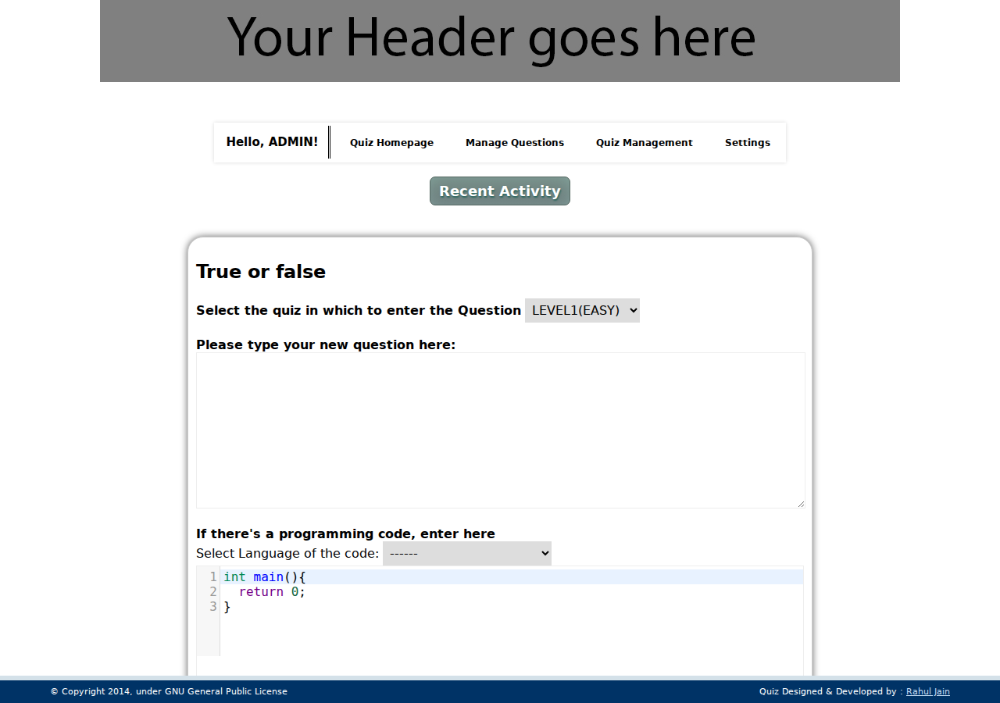
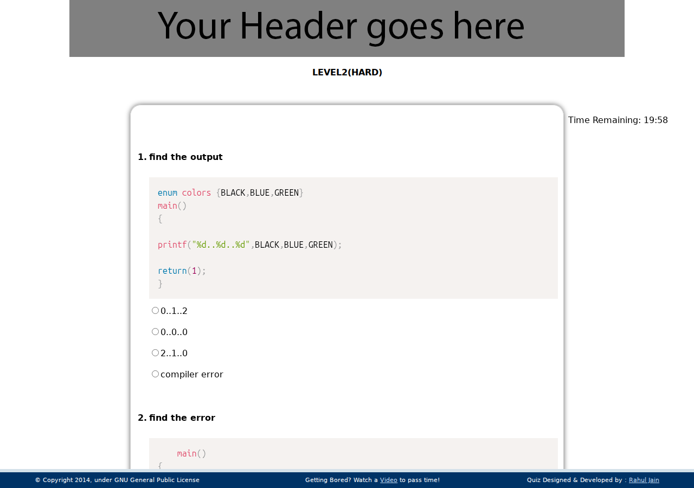

# Programming Quiz System

[](https://github.com/xRahul/Programming-Quiz-System/actions/workflows/ci.yml)
[](LICENSE)

A small timed programming-quiz app in plain PHP, originally written in 2014 and
now maintained on a modernized stack: PHPUnit test suite, prepared statements
everywhere, CSRF tokens, schema migrations, and a hardened session layer.
The legacy XAMPP-era codebase is preserved under `docs/history/v0-readme.md`.

    Short Programming Quiz Framework
    Copyright (C) 2014  Rahul Jain

## Quickstart (2 minutes)

Prereqs: PHP 8.3 CLI (+ `pdo_mysql`, `mbstring`, `xml`, `curl`), MariaDB/MySQL,
Composer.

```bash
git clone https://github.com/xRahul/Programming-Quiz-System.git
cd Programming-Quiz-System/quiz_system_git
composer install

# database: create + import the seed dataset
mysql -e "CREATE DATABASE IF NOT EXISTS debug CHARACTER SET utf8mb4 COLLATE utf8mb4_unicode_ci"
mysql debug < database/debug-v2.sql

# credentials come from the environment only -- nothing is baked into the repo
export DB_HOST=localhost DB_NAME=debug DB_USER=quiz DB_PASS='your-password' APP_ENV=production

php -S localhost:8080
# open http://localhost:8080/index.php  (admin login: http://localhost:8080/login.php)
```

See `.env.example` for the full variable list and `setup-remove.md` for a
complete native-Ubuntu toolchain install (including creating the `quiz` MySQL
user). The default admin after *Reset All Tables* is `admin` / `12345` — change
it immediately outside throwaway environments.

## Features

All legacy behavior is preserved (bug-for-bug repairs included); the v1 column
lists what this revitalization added.

| Area | Legacy (preserved) | Added in v1 |
| --- | --- | --- |
| Taking quizzes | Timed quiz, auto-submit at zero, no negative marking, once-per-quiz guard, back-button resubmit block | Quiz progress counter wired to the boot island (#30) |
| Questions | True/False + Multiple Choice with inline program code (CodeMirror editor) | JSON question-bank import/export (#31) |
| Results | Ranked by marks, then duration; Top-20 and All views | CSV results export (top/all scopes, percentage, filename contract) (#29) |
| Admin | Create/edit/delete questions & quizzes, metadata updates, set-default quiz, register/change-password/delete-account, Reset All Tables | Admin-assisted password reset (#34), audit viewer panel (#33) |
| Look & feel | Video overlay on instructions/quiz pages, favicon set, right-click disable | Responsive/a11y pass — labels, focus outlines, overflow containment (#35) |
| Branding | — | `SITE_NAME` / `SITE_LOGO` / `FOOTER_HTML` constants in `lib/config.php` (#32) |
| Operations | — | Audit log for destructive actions (#33) |

Code display uses [CodeMirror 5.65](https://codemirror.net/) for input and
[Prism 1.29](https://prismjs.com/) for syntax-highlighted output
(pinned copies under `assets/vendor/`, replacing the original
SyntaxHighlighter setup).

## Security model

- **Authentication** — every privileged page calls `require_admin()`; every
  state-changing POST verifies a CSRF token (`csrf_verify()`), with one
  deliberate exemption: the login endpoint, where a pre-auth user holds no
  token yet. All other state-changing POSTs are token-verified.
- **Sessions** — hardened cookies (HttpOnly/SameSite), ID rotation on login,
  single active-session semantics, logout destroys session + cookie.
- **Headers** — security headers (CSP, frame/media/referrer policies) set
  centrally and asserted by `SecurityHeadersTest`.
- **Escape on output** — stored values stay raw in the database; all rendering
  escapes at output time (`EscapingTest`, hostile-fixture coverage).
- **SQL** — PDO prepared statements throughout; strict-mode-safe inserts;
  schema evolution via ordered migrations in `database/migrations/`
  (charset, constraints, indexes, FKs, defaults) applied idempotently with
  `database/migrate.sh`.
- **Audit** — destructive admin actions append actor/action/detail rows to
  `audit_log`; a viewer panel renders them escaped.

Vulnerability reports: see [SECURITY.md](SECURITY.md).

## Configuration

All runtime configuration is read from the environment (`getenv()`); there are
no credential defaults committed to this repository. Copy
`.env.example` and export the values before running the server or tests.

| Variable | Purpose | Default when unset |
| --- | --- | --- |
| `DB_HOST` | Database host | `localhost` |
| `DB_NAME` | Database name | `debug` |
| `DB_USER` | Database user | *(empty)* |
| `DB_PASS` | Database password | *(empty)* |
| `APP_ENV` | `production` hides error details on failure | `production` |

Tests that need a live database skip gracefully when `DB_PASS` is empty, so a
fresh clone runs `vendor/bin/phpunit` green before you configure anything.

Branding strings (`SITE_NAME`, `SITE_LOGO`, `FOOTER_HTML`) are PHP constants
in `quiz_system_git/lib/config.php` — edit the file to rebrand; they are not
environment-driven.

## Running the tests

```bash
cd quiz_system_git
composer install
export DB_USER=quiz DB_PASS='your-password'   # or let live-DB tests skip
vendor/bin/phpunit                            # ~1-2 min typical (longer on first run: scratch DBs are provisioned fresh); needs local MariaDB
```

## Upgrading from the legacy dataset

If your installation still runs the original `database/debug.sql` dump:

> `migrate.sh` reads the same `DB_HOST` / `DB_NAME` / `DB_USER` / `DB_PASS`
> environment variables as the app (see Configuration above); its mysql client
> steps fall back to socket auth when they are unset, but the PDO decode step
> always needs real credentials.

1. Import it as before (`mysql debug < database/debug.sql`) — legacy data is
   preserved untouched.
2. Apply the migration chain: `bash database/migrate.sh` (idempotent; records
   applied steps in `schema_migrations`; converts charset, adds constraints/
   indexes/FKs, decodes stored entities, drops denormalized columns).
3. Load the matching seed baseline if you want demo content:
   `mysql debug < database/debug-v2.sql`.

## Question-bank JSON format

Admin-only round-trip format used by *Export questions* (`export_questions.php`)
and *Import questions* (`import_questions.php`, multipart field `jsonfile`,
≤2 MB):

```json
{
  "quiz": {
    "name": "Midterm A",
    "time_allotted": 45,
    "display_questions": 10
  },
  "questions": [
    {
      "question": "What does this C program print?",
      "type": "mc",
      "code": "#include <stdio.h>\nint main(){return 0;}",
      "code_type": "cpp",
      "answers": [
        { "text": "nothing", "correct": true },
        { "text": "0",       "correct": false }
      ]
    }
  ]
}
```

Validation contract:

- `quiz.name` — non-empty string; on collision the import creates
  `<name>-imported`, `<name>-imported2`, … instead of failing.
- `quiz.time_allotted`, `quiz.display_questions` — integers.
- `question.type` — `"tf"` (exactly 2 answers) or `"mc"` (2–4 answers).
- `question.code`, `question.code_type` — optional strings.
- Every answer needs non-empty `text` and boolean `correct`; exactly one
  answer per question may be `correct: true`.
- Imports are transactional: any validation failure answers HTTP 422 with a
  JSON error body and writes zero rows; successful imports are audit-logged.

## Screenshots

QA captures from the parity/security passes live in `docs/qa/`:




## Project docs

- [SECURITY.md](SECURITY.md) — supported versions, private reporting
- [CONTRIBUTING.md](CONTRIBUTING.md) — dev setup, branch flow, releases
- [CHANGELOG.md](CHANGELOG.md) — notable changes (Keep a Changelog)
- [setup-remove.md](setup-remove.md) — native Ubuntu toolchain setup/teardown
- [docs/history/v0-readme.md](docs/history/v0-readme.md) — the original 2014
  readme (historical reference)

## License

This program is free software: you can redistribute it and/or modify it under
the terms of the GNU General Public License as published by the Free Software
Foundation, either version 3 of the License, or (at your option) any later
version. See [gnu_gpl.txt](quiz_system_git/gnu_gpl.txt).

Coded & tested since 2014 by Rahul Jain.
